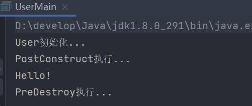
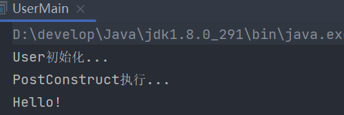

&emsp;&emsp;@PostConstruct 和@PreDestory 都可以用来注解静态的 void 方法，且都只会被调用一次。

&emsp;&emsp;如果在 Java 9 或更高版本中使用 @PostConstruct 和@PreDestory，则必须显式地将此 jar 添加到项目中。

```xml

<dependency>
	<groupId>javax.annotation</groupId>
	<artifactId>javax.annotation-api</artifactId>
	<version>1.3.2</version>
</dependency>
```

## @PostConstruct

&emsp;&emsp;@PostConstruct 注释的方法，在 Bean 的构造函数的初始化之后执行。即使没有要初始化的内容，这些方法也会运行。

&emsp;&emsp;@PostConstruct 注释的方法可以有任何访问级别，但不能是静态的。

> applicationContext.xml

```xml
<?xml version="1.0" encoding="UTF-8"?>
<beans xmlns="http://www.springframework.org/schema/beans"
       xmlns:xsi="http://www.w3.org/2001/XMLSchema-instance"
       xmlns:context="http://www.springframework.org/schema/context"
       xsi:schemaLocation="http://www.springframework.org/schema/beans http://www.springframework.org/schema/beans/spring-beans.xsd  http://www.springframework.org/schema/context
    http://www.springframework.org/schema/context/spring-context-3.0.xsd"
   >

    <context:component-scan base-package="com.staven.anno" />

</beans>
```

> User.java

```java
public class User {
    public User() {
        System.out.println("User初始化...");
    }

    @PostConstruct
    public void init() {
        System.out.println("PostConstruct执行...");
    }

    public void say() {
        System.out.println("Hello!");
    }
}
```

> UserService.java

```java
@Configuration
@ComponentScan(basePackages = "com.staven.anno")
public class UserService {
    @Bean
    public User getUser() {
        return new User();
    }
}
```

> UserMain.java

```java
public class UserMain {
    public static void main(String[] args) {
        AnnotationConfigApplicationContext context =
                new AnnotationConfigApplicationContext(UserService.class);
        User user = context.getBean(User.class);
        user.say();
    }
}
```

&emsp;&emsp;运行 UserMain.java，结果为：


```java
@Component
public class DbInit {

    @Autowired
    private UserRepository userRepository;

    @PostConstruct
    private void postConstruct() {
        User admin = new User("admin", "admin password");
        User normalUser = new User("user", "user password");
        userRepository.save(admin, normalUser);
    }
}
```

&emsp;&emsp;如果 Bean A 需要注入 Bean B，首先就必须得生成 Bean A 和 Bean B，才能执行注入。如果使用@Autowired 注解 Bean B，@Autowired 注入是发生在 A 构造方法执行完之后的。如果在初始化 Bean A 时，要同时完成某些操作，由于在构造方法中无法创建 Bean B，可以使用@PostConstruct 注解完成自动调用。

## @PreDestory

&emsp;&emsp;与@PostConstruct 相同，使用@PreDestroy 注释的方法可以具有任何访问级别，但不能是静态的。

&emsp;&emsp;@PreDestory 注解的方法会在 destory()方法执行之后执行。主要用于在 bean 被销毁之前释放资源或执行任何清理任务，例如关闭数据库连接。

> User.java

```java
public class User {
    public User() {
        System.out.println("User初始化...");
    }

    @PostConstruct
    public void init() {
        System.out.println("PostConstruct执行...");
    }

    @PreDestroy
    public void destory() {
        System.out.println("PreDestroy执行...");
    }

    public void say() {
        System.out.println("Hello!");
    }
}
```

> UserMain.java

```java
public class UserMain {
    public static void main(String[] args) {

        AnnotationConfigApplicationContext context =
                new AnnotationConfigApplicationContext(UserService.class);

        User user = context.getBean(User.class);
        user.say();

        context.close();
    }
}
```

&emsp;&emsp;运行 UserMain.java，结果为：


&emsp;&emsp;如果 Bean 的作用域是"prototype",则它不会完全由 Spring 容器管理，@PreDestroy 方法也不会被调用。

> UserService.java

```java
@Configuration
@ComponentScan(basePackages = "com.staven.anno")
public class UserService {
    @Bean
    @Scope(value="prototype")
    public User getUser() {
        return new User();
    }
}
```

&emsp;&emsp;运行 UserMain.java，结果为：

