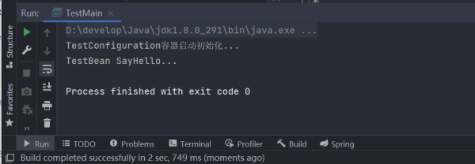

## @Configuration

&emsp;&emsp;用于定义配置类，可替换 xml 配置文件。被注解的类内部包含有一个或多个被@Bean 注解的方法，这些方法将会被 AnnotationConfigApplicationContext 或 AnnotationConfigWebApplicationContext 类进行扫描，并用于构建 bean 定义，初始化 Spring 容器。

&emsp;&emsp;@Configuration 注解的配置类有如下要求：

1. @Configuration 不可以是 final 类型
2. @Configuration 不可以是匿名类
3. 嵌套的@Configuration 必须是静态类

> TestBean.java

```java
@Component
public class TestBean {
    public void sayHello() {
        System.out.println("TestBean sayHello...");
    }
}
```

> WebBean.java

```java
@Component
public class WebBean {
    public void sayHello() {
        System.out.println("WebBean sayHello...");
    }
}
```

> TestConfiguration.java

```java
@Configuration
@ComponentScan(basePackages = "com.staven.chp05.entity")
public class TestConfiguration {
    public TestConfiguration() {
        System.out.println("TestConfiguration容器启动初始化...");
    }

    @Configuration
    static class WebConfiguration {
        public WebConfiguration() {
            System.out.println("WebConfiguration容器启动初始化...");
        }

        @Bean
        WebBean webBean() {
            return new WebBean();
        }
    }
}
```

> TestMain.java

```java
public class TestMain {
    public static void main(String[] args) {
        ApplicationContext context =
                new AnnotationConfigApplicationContext(TestConfiguration.class);

        TestBean testBean = (TestBean) context.getBean("testBean");
        testBean.sayHello();

        WebBean webBean = (WebBean) context.getBean("webBean");
        webBean.sayHello();
    }
}
```

### @configuration 嵌套

&emsp;&emsp;嵌套的@Configuration 必须是静态类。

> WebBean.java

```java
public class WebBean {
    public void running() {
        System.out.println("WebBean is Running!");
    }
}
```

&emsp;&emsp;运行 TestMain.java，可以看到 Spring 容器已经启动了：


## JavaConfig 的容器初始化

&emsp;&emsp;XML 配置的容器初始化需要借助 ClassPathXmlApplicationContext、FileSystemXmlApplicationContext 或 GenericXmlApplicationContext 类来读取配置文件并初始化。

&emsp;&emsp;使用注解方式可以使用 AnnotationConfigApplicationContext 构造器来读取@Configuration 注解配置来初始化容器。还可以识别@Bean、@Component、@Autowired 及 Java 标准注解。

> TestMain.java

```java
public class TestMain {
    public static void main(String[] args) {
        // @Configuration注解的spring容器加载方式，用AnnotationConfigApplicationContext替换ClassPathXmlApplicationContext
        ApplicationContext context =
                new AnnotationConfigApplicationContext(TestConfiguration.class);
    }
}
```

&emsp;&emsp;运行 TestMain.java，可以看到 Spring 容器已经启动了：


&emsp;&emsp;配置类还可以在上下文初始化之后通过 register()进行注册。

> TestBean.java

```java
public class TestBean {
    public void sayHello() {
        System.out.println("TestBean SayHello...");
    }

}
```

> TestMain.java

```java
public class TestMain {
    public static void main(String[] args) {
        ApplicationContext context =
        AnnotationConfigApplicationContext context = new AnnotationConfigApplicationContext();
        context.register(TestConfiguration.class);  // 注解配置类
        context.register(TestBean.class);    // 注册注解类
        context.refresh();  // 更新容器
    }
}
```

&emsp;&emsp;虽然 Spring 支持@Component 注解类作为容器初始化参数，也支持 register()进行组件注册，但更好的方式是使用类似于 XML 配置中路径扫描的方式来进行组件的注册。

## @Bean

&emsp;&emsp;使用@Configuration 注解的类相当于 XML 配置的\<beans>元素，该类中的方法使用@Bean 注解注册组件，相当于 XML 配置中的\<bean>元素。

&emsp;&emsp;@Bean 配置使用注意点：

1. @Bean 注解的方法不能是 private 或 final。
2. @Bean 注解在返回实例的方法上，如果未通过@Bean 指定 bean 的名称，摸摸人用于标注的方法名相同。
3. @Bean 注解默认作用域为单例 singleton 作用域，可通过@Scope("prototype")设置为原型作用域。
4. 既然@Bean 的作用是注册 bean 对象，那么完全可以使用@Component、@Controller、@Service、@Ripository 等注解注册 bean，当然需要配置@ComponentScan 注解进行自动扫描。
5. @Bean 注解虽然也可以用在@Component 注解的方法或其他的普通方法中，但是使用在@Configuration 注解类中是更为常见和推荐的用法。
6. 使用在@Configuration 注解类中的@Bean 注解方法不能定义 Bean 间的依赖关系，如果定义在非@Configuration 注解类的依赖关系中，则有可能被当做一般的方法被调用，而不是用来作为 Bean 定义的方法。

> TestConfiguration.java

```java
@Configuration
public class TestConfiguration {
    public TestConfiguration() {
        System.out.println("TestConfiguration容器启动初始化...");
    }

    @Bean  // @Bean注解注册Bean
    public TestBean testBean() {
        return new TestBean();
    }
}
```

> TestMain.java

```java
public class TestMain {
    public static void main(String[] args) {
        // @Configuration注解的spring容器加载方式，用AnnotationConfigApplicationContext替换ClassPathXmlApplicationContext
        ApplicationContext context =
                new AnnotationConfigApplicationContext(TestConfiguration.class);

        TestBean testBean = (TestBean) context.getBean("testBean");
        testBean.sayHello();
    }
}
```

&emsp;&emsp;运行 TestMain.java，可以看到 TestBean 已经被注册：



### @Bean 管理 bean 的生命周期

&emsp;&emsp;@Bean 支持两种属性：initMethod 和 destoryMethod。在实例化或即将销毁它是，容器将回调用它们。

> TestBean.java

```java
public class TestBean {
    private String username;
    private String password;
    private String url;

    public void sayHello() {
        System.out.println("TestBean SayHello...");
    }

    public void init() {
        System.out.println("TestBean初始化...");
    }

    public void destory() {
        System.out.println("TestBean销毁...");
    }
}
```

```java
@Configuration
public class TestConfiguration {
    public TestConfiguration() {
        System.out.println("TestConfiguration容器启动初始化...");
    }

    @Bean(name="testBean", initMethod="init", destoryMethod="destory")
    @Scope("prototype")
    public TestBean testBean() {
        return new TestBean();
    }
}
```

&emsp;&emsp;运行 TestMain.java，可以看到 TestBean 已经被注册：


## @ComponentScan

&emsp;&emsp;XML 配置方式中使用\<context:component-scan>标签配置自动扫描@Component 等注解的组件，base-package 属性设置需要扫描的路径。

&emsp;&emsp;在使用注解配置方式中可以结合@ComponentScan 与@Configuration 实现此功能，使用属性 basePackages 是指扫描的路径。

> TestBean.java

```java
@Component
public class TestBean {
    public void sayHello() {
        System.out.println("TestBean SayHello...");
    }
}
```

> TestConfiguration.java

```java
@Configuration
@ComponentScan(basePackages = "com.staven.anno")
public class TestConfiguration {
    public TestConfiguration() {
        System.out.println("TestConfiguration容器启动初始化...");
    }
}
```

> TestMain.java

```java
public class TestMain {
    public static void main(String[] args) {
        ApplicationContext context =
                new AnnotationConfigApplicationContext(TestConfiguration.class);

        TestBean testBean = (TestBean) context.getBean("testBean");
        testBean.sayHello();
    }
}
```

&emsp;&emsp;AnnotationConfigApplicationContext 还提供了 scan()方法在容器初始化之后对包中的组件进行扫描注册,

```java
public class TestMain {
    public static void main(String[] args) {
        ApplicationContext context =
                new AnnotationConfigApplicationContext(TestConfiguration.class);

       context.scan("com.staven.anno");   // 组件扫描方法
        context.refresh();  // 更新容器
    }
}
```

&emsp;&emsp;因为@Configuration 是@Component 的子注解，所以@Configuration 注解的类也会被扫描并处理。实际项目中，@Configuration 和@Component 注解的类放在不同的包中。

## @Import

&emsp;&emsp;使用在@Configuration 的注解类中，用于导入其他的注解类。可用于分组配置：

> WebConfiguration.java

```java
@Configuration
@Import(TestConfiguration.class)
public class WebConfiguration {
    public WebConfiguration() {
        System.out.println("WebConfiguration容器启动初始化...");
    }
}
```

> TestMain.java

```java
public class TestMain {
    public static void main(String[] args) {
        ApplicationContext context =
                new AnnotationConfigApplicationContext(WebConfiguration.class);

        TestBean testBean = (TestBean) context.getBean("testBean");
        testBean.sayHello();
    }
}
```

&emsp;&emsp;运行 TestMain.java，可以看到容器已经被实例化：


&emsp;&emsp;@ComponentScan 与@Import 都可以接受任意@Component 或@Configuration 类。另外使用@ImportResource 还可以导入 XML 的配置文件。
