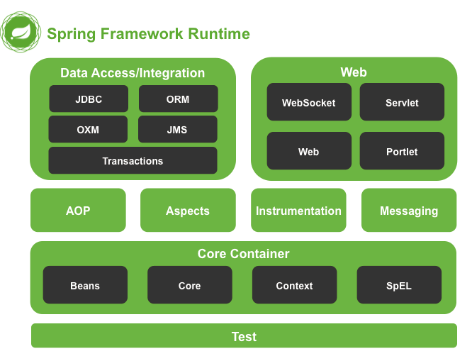

## Spring 简介

&emsp;&emsp;Spring 是一个开源的轻量级的 Java 开发框架，是具有 IoC(Inversion Of Control，控制反转)和 AOP(Aspect Oriented Programmin，面向切面)两大核心的容器框架。通过声明式方式灵活地进行事务的管理，提高开发效率和质量。

## Spring 特点

1. 方便解耦，简化开发

&emsp;&emsp;Spring 就是一个大工厂，可以将所有对象的创建和依赖关系的维护交给 Spring 管理。

2. 方便集成各种优秀框架

&emsp;&emsp;Spring 不排斥各种优秀的开源框架，其内部提供了对各种优秀框架（如 Struts2、Hibernate、MyBatis 等）的直接支持。

3. 降低 Java EE API 的使用难度

&emsp;&emsp;Spring 对 Java EE 开发中非常难用的一些 API（JDBC、JavaMail、远程调用等）都提供了封装，使这些 API 应用的难度大大降低。

4. 方便程序的测试

&emsp;&emsp;Spring 支持 JUnit4，可以通过注解方便地测试 Spring 程序。

5. AOP 编程的支持

&emsp;&emsp;Spring 提供面向切面编程，可以方便地实现对程序进行权限拦截和运行监控等功能。

6. 声明式事务的支持

&emsp;&emsp;只需要通过配置就可以完成对事务的管理，而无须手动编程。

## Spring 体系结构

&emsp;&emsp;Spring 框架采用分层架构，包含 20 多个模块，7 大功能分类：

- 数据访问/集成
- Web 与远程调用
- 面向切面编程
- 检测
- 消息
- 容器核心
- 测试

### 数据访问/集成(Data Access/Integration)

&emsp;&emsp;包含 JDBC、ORM、OXM、JMS、Transactions 五个模块。

- JDBC 模块：提供了 JDBC 的抽象层，简化了对数据库连接和操作的编码。

- ORM 模块：对流行的对象关系映射 API，对多个流行的 ORM 框架提供了统一的数据操作方式，包含 JPA、JDO、Hibernate 和 MyBatis。

- OXM 模块：提供了一个支持对象/XML 映射的抽象层实现。比如 JAXB、Castor、XML Beans、JiBX 和 Xstream 等。

- JMS 模块：提供了对消息功能的支持，可以生产和消费信息。

- Transactions（事务处理）模块：支持编程和声明式事务管理实现特殊接口类，支持 JDBC 和所有 ORM 框架。

&emsp;&emsp;Spring 在 DAO 的抽象层面，对不同的数据访问技术进行了统一和封装，建立了一套面向 DAO 的统一异常体系。

### Web 与远程调用

&emsp;&emsp;包含 Servlet、Web、WebSocket、Portlet 模块。

- Servlet 模块：包含了一个强大的 MVC 框架，用于 Web 应用实现视图层与逻辑层的分离。

- Web 模块：提供了面向 Web 基本功能和 Web 应用的上下文，例如使用 Servlet 监听器的 Ioc 容器初始化、文件上传功能等。此模块还包括了 HTTP 客户端和 Spring 远程调用等。

- WebSocket 模块：支持在 Web 应用中客户端与服务端给予 Websocket 的双向通信。

- Portlet 模块：提供了用于 Portlet 环境的 MVC 实现。

&emsp;&emsp;除了 Web 应用外，Spring 还提供了对 REST API 的支持。Spring 自带一个远程调用框架 HTTP invoker，其集成了 RMI、Hessian、Burlap 和 JAX-WS。

### 面向切面编程

&emsp;&emsp;包含 AOP、AspectJ 模块。

- 在 AOP 模块中，Spring 提供了面向切面编程的支持，类似于事务和安全等关注点从应用中解耦出来。

- AspectJAspectJ 是一个面向切面编程的框架，Spring AspectJ 模块提供了对它的集成。

### 检测

&emsp;&emsp;Instrumentation 模块提供了在应用服务器中实用类工具的支持和类加载器实现。Instrument Tomcat 是针对 Tomcat 的 Instrument 实现。

### 消息

&emsp;&emsp;Messaging 模块用于消息处理，也包含了一系列用于映射消息的注解。

### 测试

&emsp;&emsp;Test 模块通过 Junit 和 TestNG 框架支持的单元测试和集成测试，提供了一系列的模拟对象辅助单元测试。另外 Spring 提供了集成测试的框架，可以很容易地加载和获取应用的上下文。

### 容器核心

&emsp;&emsp;包含 Beans、Core、Context、SpEL 模块。

- Beans 模块：提供了 BeanFactory，是工厂模式的经典实现。Beans 模块负责 Beans 的创建、拼接、管理和获取的工作。

- Core 核心模块：提供了 Spring 的基本组成部分，包括 IoC、DI 功能。

- Context 上下文模块：在 Beans 和 Core 模块之上进行了功能的扩展，添加了国际化、框架事件体系、Bean 生命周期管理和资源加载透明化等功能。是访问定义和配置的任何对象的媒介。ApplicationContext 接口是其核心接口。而 Context-support 模块还提供了其他企业级服务的支持，包括邮件服务、JNDI 访问、任务调度和 EJB 集成等。

- SpEL 模块：是统一语言表达式（Unified EL）的一个扩展，用于查询和管理容器管理对象、获取和设置对象属性、调用对象方法、操作数据等。此外，SpEL 表达式还可具备逻辑表达式运算和变量定义等功能。基于此表达式，就可以通过字符串与容器进行交互。

## Spring 框架模块的 Maven 对应

&emsp;&emsp;组名（groupId）是 org.springframework，各模块分别对应不同的项目(artifactId)。
| 模块名 | Maven 项目名 | 描述 |
| :--------------------- | :----------------------- | :------------------------------- |
| Core | spring-core | 核心库 |
| Beans | spring-beans | Bean 支持 |
| Contect | spring-context | 应用的上下文 |
| Contect | spring-context-support | 集成第三方库到上下文 |
| SpEl | spring-expression | Spring 表达式语言 |
| AOP | spring-aop | 基于代理的 AOP |
| Aspects | spring-aspects | 与 AspectJ 集成 |
| Instrumentation | spring-instrument | JVM 引导的检测代理 |
| Instrumentation Tomcat | spring-instrument-tomcat | Tomcat 的检测代理 |
| Messaging | spring-messaging | 消息处理 |
| JDBC | spring-jdbc | JDBC 的支持与封装 |
| Transaction | spring-tx | 事务处理 |
| ORM | spring-orm | 对象关系映射，支持 JPS 和 Hibernate |
| OXM | spring-oxm | 对象 XML 映射 |
| JMS | spring-jms | JMS 消息支持 |
| Servlet | spring-webmvc | MVC 框架及 REST Web |
| Portlet | spring-webmvc-portlet | Portlet 环境的 MVC 实现 |
| Web | spring-web | 客户端及 Web 远程调用 |
| WebSocket | spring-websocket | Websocket 和 SockJS 实现 |
| Test | spring-test | 测试模拟对象和测试框架 |

## Jar包
&emsp;&emsp;Jar包下载：
[https://repo.spring.io/ui/#/artifacts/browse/tree/General/libs-release-local/org/springframework/spring](https://repo.spring.io/ui/#/artifacts/browse/tree/General/libs-release-local/org/springframework/spring)
[https://repo.spring.io/ui/native/libs-release-local/org/springframework/spring/](https://repo.spring.io/ui/native/libs-release-local/org/springframework/spring/)

* spring-core
* spring-context
* spring-beans
* spring-expression
* spring-jcl
* junit
* hamcrest-core