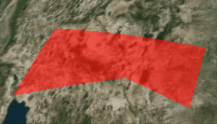

```js
const viewer = new Cesium.Viewer("cesiumContainer");

// 设定模拟时间的界限
const start = Cesium.JulianDate.fromDate(new Date(2015, 2, 25, 16));
const stop = Cesium.JulianDate.addSeconds(start, 360, new Cesium.JulianDate());

// 确保查看器处于所需时间
viewer.clock.startTime = start.clone();
viewer.clock.stopTime = stop.clone();
viewer.clock.currentTime = start.clone();
viewer.clock.clockRange = Cesium.ClockRange.LOOP_STOP; // 在末尾循环
viewer.clock.multiplier = 10;
// 将时间线设置为模拟边界
viewer.timeline.zoomTo(start, stop);

// 每3秒切换颜色
function getColorProperty() {
  var property = new Cesium.CompositeMaterialProperty();
  var startTime = start.clone();
  for (var i = 0; i <= 360; i += 1) {
    var stopTime = Cesium.JulianDate.addSeconds(
      start,
      i,
      new Cesium.JulianDate()
    );

    // const color = Cesium.Color.fromRandom({
    //   alpha: 1.0,
    // });

    const color =
      i % 6 < 3
        ? Cesium.Color.RED.withAlpha(0.5)
        : Cesium.Color.BLUE.withAlpha(0.8);

    property.intervals.addInterval(
      new Cesium.TimeInterval({
        start: startTime,
        stop: stopTime,
        isStopTimeIncluded: false,
        data: new Cesium.ColorMaterialProperty(color),
      })
    );
    startTime = stopTime.clone(startTime);
  }
  return property;
}

const polygon = viewer.entities.add({
  polygon: {
    hierarchy: Cesium.Cartesian3.fromDegreesArray([
      -115.0,
      37.0,
      -115.0,
      32.0,
      -107.0,
      33.0,
      -102.0,
      31.0,
      -102.0,
      35.0,
    ]),
    material: getColorProperty(),
  },
});

viewer.zoomTo(polygon);
```



```js
const viewer = new Cesium.Viewer("cesiumContainer");

const start = Cesium.JulianDate.fromDate(new Date());
const stop = Cesium.JulianDate.addSeconds(start, 360, new Cesium.JulianDate());

viewer.clock.startTime = start.clone();
viewer.clock.stopTime = stop.clone();
viewer.clock.currentTime = start.clone();
viewer.clock.clockRange = Cesium.ClockRange.LOOP_STOP;
viewer.clock.multiplier = 10;
viewer.timeline.zoomTo(start, stop);

const position = Cesium.Cartesian3.fromDegrees(-103.0, 40.0, 350000);
viewer.camera.lookAt(position, new Cesium.HeadingPitchRange(0, -90, 1000000));

function createTimeIntervalCollectionProperty(
  startSeconds,
  stopSeconds,
  step,
  isOutline
) {
  var property = new Cesium.TimeIntervalCollectionProperty(Cesium.Color);
  for (let i = startSeconds; i <= stopSeconds; i += step) {
    let color;
    if (i & 1) {
      color = isOutline ? Cesium.Color.BLACK : new Cesium.Color(1, 0, 0, 0.5);
    } else {
      color = isOutline ? Cesium.Color.GREEN : new Cesium.Color(0, 0, 1, 0.5);
    }

    const timeInterval = new Cesium.TimeInterval({
      start: Cesium.JulianDate.addSeconds(start, i, new Cesium.JulianDate()),
      stop: Cesium.JulianDate.addSeconds(
        start,
        i + step,
        new Cesium.JulianDate()
      ),
      isStartIncluded: true,
      isStopIncluded: false,
      data: color,
    });
    property.intervals.addInterval(timeInterval);
  }
  return property;
}

viewer.entities.add({
  name: "ellipsoid",
  position,
  ellipsoid: {
    radii: new Cesium.Cartesian3(300000.0, 300000.0, 300000.0),
    material: new Cesium.ColorMaterialProperty(
      createTimeIntervalCollectionProperty(0, 360, 15, false)
    ),
    outline: true,
    outlineColor: createTimeIntervalCollectionProperty(0, 360, 15, true),
  },
});
```


