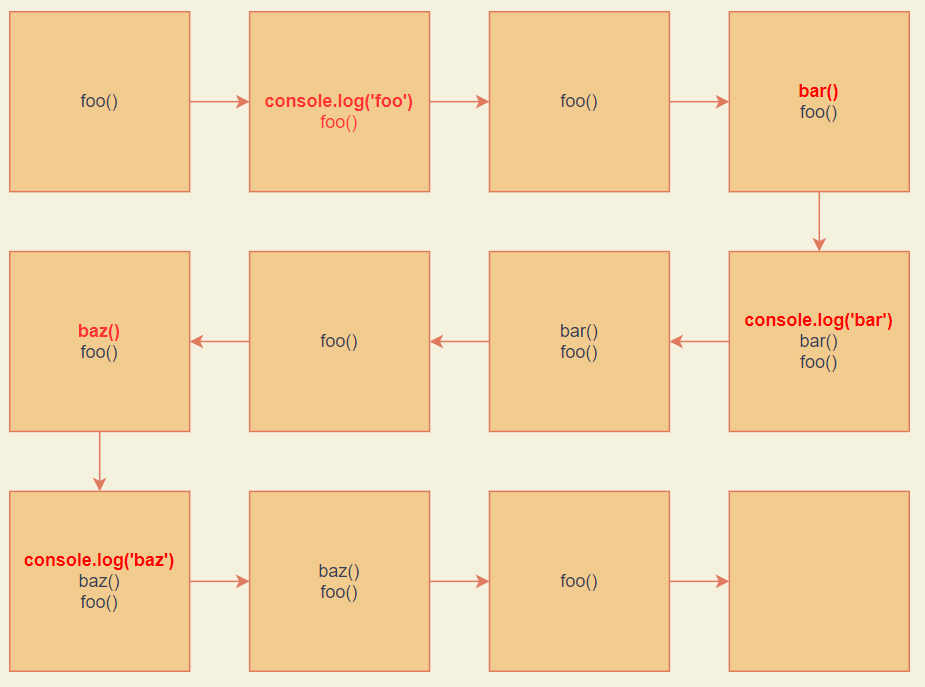
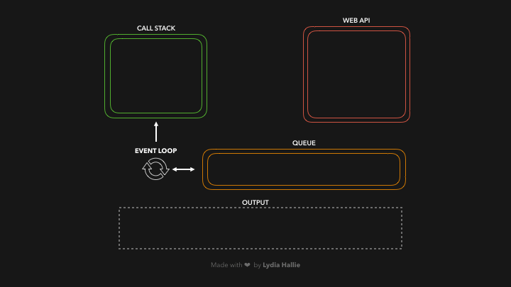
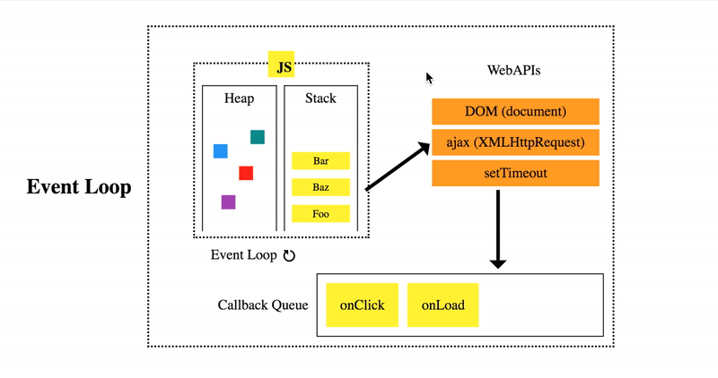

# 单线程

&emsp;&emsp;JavaScript 是一个单线程、非阻塞、异步、解释性脚本语言。同一个时刻只能运行一个任务。

&emsp;&emsp;但浏览器是多线程的，执行 JS 任务的线程只是其中一个线程，是浏览器提供的主线程。

# 调用堆栈与任务队列

&emsp;&emsp;函数被调用时，它会被添加到调用堆栈中。调用堆栈是个 LIFO（先进后出）的堆栈。当一个函数调用结束时，它会从堆栈中弹出。

### 堆

&emsp;&emsp;对象被分配在堆中，堆是一个用来表示一大块内存区域的计算机术语。

### 栈

&emsp;&emsp;函数调用会创建一个新的栈帧。

```js
const bar = () => console.log("bar");

const baz = () => console.log("baz");

const foo = () => {
  console.log("foo");
  bar();
  baz();
};

foo();

// foo
// bar
// baz
```

&emsp;&emsp;此段程序代码的调用堆栈如下：



&emsp;&emsp;每次事件循环会查看调用堆栈中是否有内容，并执行它，直到调用栈为空。

- 特征：每一个任务完整地执行后，其它任务才会被执行。
- 优势：当一个任务执行时，不会被其他任务抢占
- 缺点：当一个任务需要很长时间处理时，会阻塞用户的交互。

### 消息队列

&emsp;&emsp;JavaScript 运行时包含了一个待处理消息的消息队列。每一个消息都关联着一个用以处理这个消息的回调函数。

```js
const foo = () => console.log("First");
const bar = () => setTimeout(() => console.log("Second"), 500);
const baz = () => console.log("Third");

bar();
foo();
baz();

// First
// Third
// Second
```

&emsp;&emsp;此段程序代码的调用堆栈如下：



&emsp;&emsp;循环优先处理调用栈，它首先处理在调用栈中找到的所有东西，一旦里面没有任何东西，它就会去消息队列中取东西。

&emsp;&emsp;当 setTimeout() 被调用时，浏览器或 Node.js 启动计时器。一旦计时器到期，在这种情况下，我们立即 0 作为超时，回调函数将被放入消息队列中。

### ES6 Job Queue

&emsp;&emsp;ECMAScript 2015 引入了 Job Queue 的概念，它被 Promises 使用（也在 ES6/ES2015 中引入）。这是一种尽快执行异步函数结果的方法，而不是放在调用堆栈的末尾。

&emsp;&emsp;在当前函数结束之前解析的 Promise 将在当前函数之后立即执行。

```js
const bar = () => console.log("bar");

const baz = () => console.log("baz");

const foo = () => {
  console.log("foo");
  setTimeout(bar, 0);
  new Promise((resolve, reject) =>
    resolve("This is a Promise")
  ).then((resolve) => console.log(resolve));
  baz();
};

foo();

// foo
// baz
// This is a Promise
// bar
```

# 同步任务与异步任务

&emsp;&emsp;任务主要分成两种：同步任务(synchronous)和异步任务(asynchronous)。

&emsp;&emsp;同步任务指的是，在主线程上依次执行的任务，前一个任务执行结束，后一个任务才开始执行。

&emsp;&emsp;异步任务不会直接进入主线程，而是进入“任务队列”(task queue)，只有“任务队列”通知主线程，某个异步任务可以执行了，该任务才会进入主线程执行。

# 事件循环(Event Loop)


&emsp;&emsp;JavaScript 在解析一段代码时，会将同步代码按顺序在执行栈中执行，遇到异步任务时就交给浏览器其他线程处理。

&emsp;&emsp;等到当前执行栈中所有同步代码执行完成后，会从一个队列中去取出已完成的异步任务的回调加入执行栈继续执行，遇到异步任务接着交给其他线程。

# 宏任务与微任务

&emsp;&emsp;事件循环中任务队列分为：宏任务(macro)队列和微任务(micro)队列。

##### 宏任务

宏任务队列的优先级较低。宏任务包括解析 HTML、生成 DOM、执行主线程 JavaScript 代码和其他事件，如页面加载、输入、网络事件、定时器事件等。

常见宏任务：

- setTimeout
- setInterval
- setImmediate
- requestAnimationFrame
- script
- I/O 操作
- UI 渲染

##### 微任务

&emsp;&emsp;一个微任务还能将其他微任务加入队列。在新的微任务被添加到队列的末尾并且也被处理，直到没有更多微任务，即使新任务不断添加。

常见微任务：

- Promise
- process.nextTick
- MutationObserver

##### 结合宏/微任务的事件循环

&emsp;&emsp;时间循环过程中，执行栈在同步代码执行完成后，优先检查微任务队列是否有任务需要执行，如果没有，再去检查宏任务队列是否有任务可执行。循环往复。

&emsp;&emsp;微任务一般在当次循环中就会优先执行，而宏任务会等到下一次循环。

&emsp;&emsp;微任务执行完成后，也就是一次事件循环结束后，浏览器会执行视图渲染。

- [面试率 90% 的 JS 事件循环 Event Loop，看这篇就够了](https://blog.csdn.net/m0_46374969/article/details/119969908)
